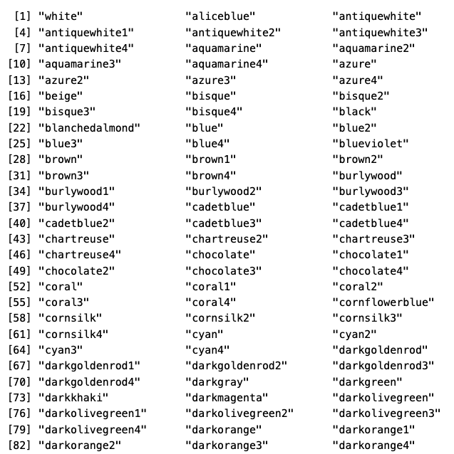
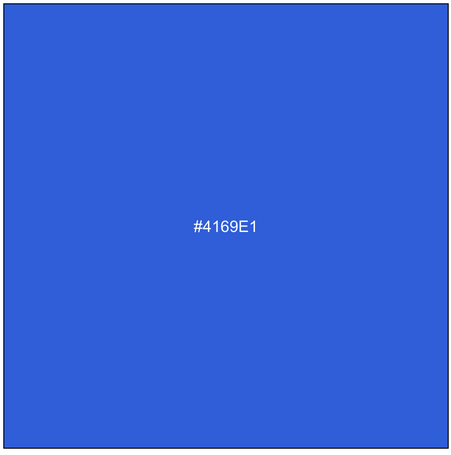
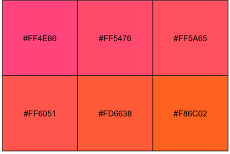
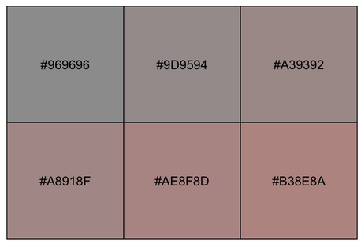
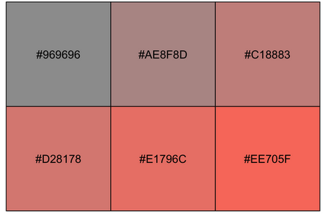
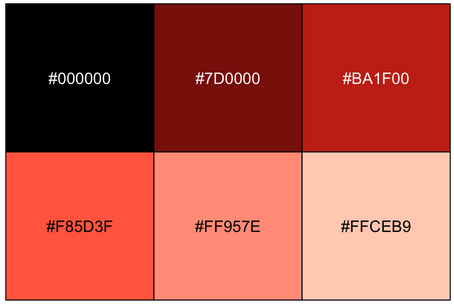

## What are hexcodes? 

Hexadecimals, or 'hex codes,' operate on a number system with a base value of 16, hence the term 'hex.' In R, we use them to integrate colors into plots, presentations, websites or really anything. These codes represent colors through a blend of red, green, and blue (RGB) values, where each color is denoted by a two-digit hexadecimal number ranging from 00 (representing the absence of color) to FF (representing the maximum intensity). For instance, if we would like a pure red color, we'd utilize #FF0000, for green, #00FF00, or for blue, #0000FF. Similarly, we can produce a yellow shade with #FFFF00 or an aqua tone with #00FFFF. Additionally, we can use any number from 0 to 9 and any letter from A to F. For example, orange corresponds to #FFA500, while tomato red is represented by #FF6347.


## Where do we locate them? 

There are some great online resources like [ColorHexa](https://www.colorhexa.com/), [this color cheatsheet](https://www.nceas.ucsb.edu/sites/default/files/2020-04/colorPaletteCheatsheet.pdf), or just [Google](https://www.google.com/search?client=firefox-b-1-d&q=aqua+hex+color+code) in general. However, another way to locate them within your RStudio IDE is by utilizing the {scales} package and the col2hcl function. Let's walk through some steps to see how.


### Install and load

```r
# install.packages("scales")

library(scales)

```

### Find a color


```r
colors(distinct = TRUE)


```




Use show_col and col2hcl to show the color code.


```r
show_col(col2hcl("royalblue"))


```




Boom! Now that we've got our color code, let's explore further. There's a handy method for looking up multiple color codes and adjusting the hue, chroma, and luminance if the exact color you're seeking isn't readily available.

### Let's check out some variations in tomato 🍅 colors!

```r
tomatoes <- rep("tomato", 6) # we have to create a vector here to allow multiple to show
show_col(col2hcl(tomatoes, h = seq( 0, 25, length = 6))) # we are modifying our hue here

```



Lets break this down. 

**show_col** allows the visualization to occur in R.

**col2hcl**  is responsible for providing us with the hexadecimal codes for colors.

* We throw in our vector (i.e, our 🍅)
* Then we can modify our hue a bit with **seq** and any number between [0, 360]
* It's a good idea to keep the 0 at the start, and for a broader range of similar colors, keep the next number (or the range between the two) small. 

**length** this just lets R know how many color we want to show. 

**h** or hue, ff you want to vary the color slightly.


We can also modify our **chroma** and/or **luminance**.

If you want the intensity to change we can use the chroma argument. We use a similar process as before but this time we use “c”. The range for chroma is [0, 100]

```r
show_col(col2hcl(tomatoes, c = seq( 0, 25, length = 6))) 

```



Yikes, wouldn't want to eat those tomatoes. 

Let max the argument out and see what happens.

```r
show_col(col2hcl(tomatoes, c = seq( 0, 100, length = 6))) 

```


A better variation to choose from.

If we want to look at variations in the intensity of our 🍅s we can use the **luminance** or **l** argument. 

Our luminescence range is [0, 100]


```r
show_col(col2hcl(tomatoes, l = seq( 0, 100, length = 6))) 


```



BA1F00 and F85D3F are looking like suitable 🍅s. 


## Final thoughts

Like anything in R, there's a million ways to do one thing and this is just another option to locating your color codes. For more information, check out [modify standard R colour in hcl colour space](https://scales.r-lib.org/reference/col2hcl.html#ref-examples).


