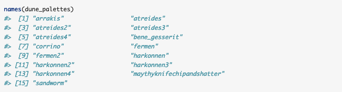

Want to add some 'spice' to your {ggplot2} data visualizations? You're in the right place! I'm excited to introduce [{Rdune}](https://github.com/nvietto/Rdune), a collection of 15 color palettes inspired by 'Dune'. 

<p align="center">
    <br>
    <small>Image: <a href="https://giphy.com">giphy.com</a></small>
</p>

### How to install and load

Currently, only the developmental version of {Rdune} is available on [GitHub](https://github.com/nvietto/Rdune). If you're unfamiliar with how to download a developmental version of an R library, simply follow these steps:

1) Install {devtools}

```r
install.packages("devtools")

```

2) Load {devtools}

```r
library(devtools)

```
3) Install {Rdune} from GitHub

```r
devtools::install_github("nvietto/Rdune")

```
4) Load {Rdune}

```r
library(Rdune)

```

Now that {Rdune} is installed, you can load it like any other R library in the future using `library(Rdune)`.

### Functions 

Here are the key functions used in {Rdune}: 

* **names(dune_palettes)**
  - Prints the names of all 15 palettes currently available. 
  
* **print.palette()**
  - Displays the colors of a palette.
  - Note: The palette must be assigned to an object to print colors properly (I'm working on improving this).
* **{ggplot2} functions**:  
(Note: be sure to add " " around the palette name)
  - **scale_fill_dune_d()**
    * Applies a discrete {Rdune} palette to the fill aesthetic in ggplot2.
  - **scale_fill_dune_c()**
    * Applies a continuous {Rdune} palette to the fill aesthetic in ggplot2.
  - **scale_color_dune_d()**
    * Applies a discrete {Rdune} palette to the color aesthetic in ggplot2.
  - **scale_color_dune_c()**
    * Applies a continuous {Rdune} palette to the color aesthetic in ggplot2.


### Examples


```r
names(dune_palettes)

```


``` r
pal <- dune_palette("atreides4")

print.palette(pal)

```
<p align="center">
  
</p>

You can view the inspiration for this palette below. (Note: You can find the inspiration for all the palettes at the [GitHub repo](https://github.com/nvietto/Rdune)). 

<p align="center">
  
</p>


Now lets add this palette to a {ggplot2} plot using **scale_color_dune_c()**:

```r
library(ggplot2)
ggplot(data.frame(x = rnorm(10000), y = rnorm(10000)), 
       mapping = aes(x = x, y = y)) +
  geom_hex() + 
  scale_fill_dune_c(name = "atreides4")

```

<p align="center">
  
</p>


Let's try a **scale_fill_dune_d()**:

``` r
ggplot(
  data = iris,
  mapping = aes(x = Sepal.Length, fill = Species)) +
  geom_density(alpha = 0.5) + 
  scale_fill_dune_d(name = "atreides4")

```
<p align="center">
  
</p>

### Final Remarks 

I hope you enjoy {Rdune} as much as I do. If you would like more examples on how to use the package, feel free to checkout the [vignette](https://nvietto.github.io/Rdune/articles/my-vignette.html). I plan to submit it to CRAN in the upcoming weeks, so if you find any bugs or have any suggestions, please open an issue on the GitHub repo. Enjoy!

<br>

<p align="center">
    <br>
    <small>Image: <a href="https://giphy.com">giphy.com</a></small>
</p>


