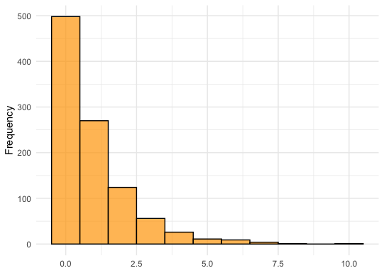

While preparing lecture materials for undergraduate statistics, I often found myself repeatedly looking up code documentation on how to generate distributions. This might just be a 'me problem' — having the memory of a goldfish 😅 — but I figured, "Hey, maybe someone else has this issue too." So, I developed [{samplezoo}](https://nvietto.github.io/samplezoo/) to save time and help educators focus more on creatively teaching statistical concepts rather than spending that time on setup.


### Install


```r
install.packages("samplezoo")

library(samplezoo)

```

### How to use 

The three dataset sizes are:


```r
data <- samplezoo("small")

```

* **small**: Generates a data frame with 100 samples.

```r
data <- samplezoo("medium")

```

* **medium**: Generates a data frame with 1,000 samples.

```r
data <- samplezoo("large")

```

* **large**: Generates a data frame with 10,000 samples.


### What's in each column 

The output will be a data frame with the following columns:

**norm**: Normal distribution with mean and standard deviation parameters

**norm2**: Slight variation of the normal distribution

**norm3**: Another slight variation of the normal distribution

**binom**: Binomial (Bernoulli) distribution

**neg**: Negative binomial distribution

**pois**: Poisson distribution

**exp**: Exponential distribution

**unif**: Uniform distribution

**beta**: Beta distribution

**gamma**: Gamma distribution

**chisq**: Chi-squared distribution

**t_dist**: Student's t-distribution


### Example - Negative Binomial Distribution

```r
library(tidyverse)

set.seed(123)

data <- samplezoo("medium")

data |> 
  ggplot(aes(neg)) +
  geom_histogram(binwidth = 1, fill = "orange", alpha = 0.7, color = "black") + 
  theme_minimal() +
  labs(y = "Frequency") +
  theme(axis.title.x = element_blank())

```

<p align="center">
  
</p>


### Final Remarks 

I initially considered adding a parameter to introduce missing data into the data frames, but I decided against it to keep the package simple. For those interested in adding features like missing values, I recommend checking out the [{messy}](https://nrennie.rbind.io/messy/) package.

Finally, there's a lot that could be added to {samplezoo} (e.g., more columns to the 'large' dataset to better utilize its size or the spacing I forgot to add in the norm_2 and norm_3 columns 🙄), but I'm going to hold off for a bit and see if people find it valuable. 

Thanks for reading!


