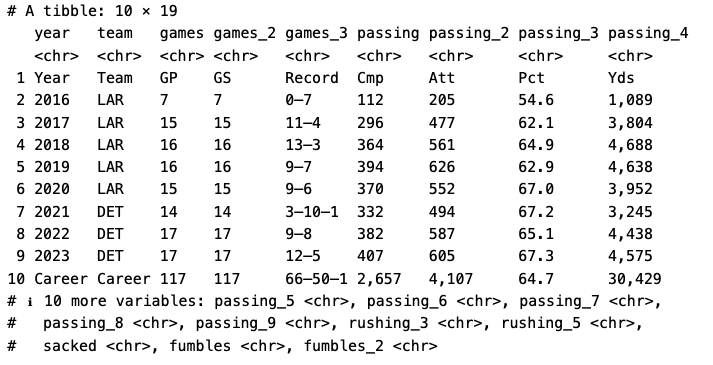

If you share my passion for NFL stats, you might have considered getting some data to analyze or even predict outcomes. Instead of tediously inputting data into Excel, you can opt for a more efficient method: web scraping with {rvest} in R.

Let's scrape the career stats of Jared Goff from the Detroit Lions 🦁

## Set up & Scrape

Lets install and load our packages.


We will need the [**tidyverse**](https://www.tidyverse.org/) and [**janitor**](https://cran.r-project.org/web/packages/janitor/vignettes/janitor.html) packages. 


```r
pacman::p_load(tidyverse, rvest, janitor)

```


Next, we need to get the webpage URL [here](https://en.wikipedia.org/wiki/Jared_Goff). And copy it and create an object. 


```r
# here we are creating the URL object
goffstats_url <- 'https://en.wikipedia.org/wiki/Jared_Goff'


# this reads the html and passes it through the html_table function
goffstats <- read_html(goffstats_url) |> 
  html_table()

```

**Note:** If you’re curious what html_table() does, copy and paste the following code into your console and press enter: **?html_table** 


There are many tricks to locating the correct html table. Pulling up the object (i.e., goffstats) from the environment and then examining the value column to find the correct dimensions of the table you want from the website you scraped (i.e., the wiki page) is my preferred method. 

For example, head [here](https://en.wikipedia.org/wiki/Jared_Goff) and scroll down to NFL career statistics then regular season and count the rows and columns. After you have a decent idea of the dimensions, head to your object (i.e., goff_stats) and try to match the dimensions. Object **[[6]]** with the **value 10 x 23** is the one we want so we create a new object with that information. 

```r
career_stats <- goffstats[[6]]

```


🎉 Alright, we have officially scraped the website and got our HTML table! 🎉


## Cleaning

Alright, here’s were it gets tricky. We want to use the {janitor} package and its function clean_names(), which transforms all the columns into a data friendly format.

```r
career_stats1 <- career_stats |>
  clean_names() |> 
  as.tibble() |> # I prefer to look at things in tibble format, it's just a bit nicer
  select(- c(rushing, rushing_2, rushing_4, sacked_2)) # this removes the columns that I don't really find important for the QB position

```




Next, we are going to rearrange some of our data table so the character variables are in front of our tibble.

```r
# here I'm creating an object that holds the columns I want to move up front
# we will find out soon why I want these up front

career_statsM <- c("year",
                   "team", 
                   "games_3")


# this create a new object with the non-numerical columns in the front and everything else after it
career_stats2 <- career_stats1 |> 
  select(all_of(career_statsM), everything())


```


Now, we have to do some major cleaning of this data. We are going to rename, slice, and mutate. Examples of these commands can be located [here](https://raw.githubusercontent.com/rstudio/cheatsheets/main/data-transformation.pdf). 


```r 
career_stats3 <- career_stats2 |>
  rename(games_played = games,  # making these columns a bit easier to understand and work with
         games_started = games_2,
         record = games_3,
         completions = passing,
         attempts = passing_2,
         comp_pct = passing_3,
         yards = passing_4, 
         ypera = passing_5,
         longest_pass = passing_6,
         tds = passing_7,
         intercept = passing_8,
         pass_rate = passing_9,
         rush_ypera = rushing_3,
         rush_td = rushing_5,
         fumbles_lost = fumbles_2) |> 
  slice_tail(n = -1) |> # this slices the top row out of our data frame (i.e., the extra row of column names)
  slice_head(n = -1) |> # this slices the bottom row (i.e., career stats)
  mutate(yards = str_remove_all(yards, ",")) |>  # we don't want a " , " in our variable bc R considers it a string or a character
  mutate(across(4:19, as.numeric)) # Here's why we moved those other columns to the front, so we can easily convert the others to numerics


```

### Optional  

The next code chunk  will create an interactive table but it has to be implemented into an html file using RMarkdown/Quarto

```r
interactivetable <- career_stats3 |> 
  knitr::kable()

interactivetable

```


That’s it! the data is clean and now we can analyze it! 🏈


## Analyze 

You can do anything with the data now, but make sure you are using the numeric values.

```r
mean(career_stats3$yards)

```
[1] 3803.625

```r 
mean(career_stats3$tds)

```

[1] 23.125


<p style="text-align: center;">

</p>

## Final Remarks

There are legalities to consider before scraping any website. Although if it is public domain like [Wikipedia](https://en.m.wikipedia.org/wiki/Wikipedia:Copyrights), you're probably ok. But please refer to [this](https://r4ds.hadley.nz/webscraping) section in the R4DS book for more information. They do a much better job explaining things than me.  


IF you want to learn more about {rvest} check out [R for Data Science (2e)](https://r4ds.hadley.nz/).


