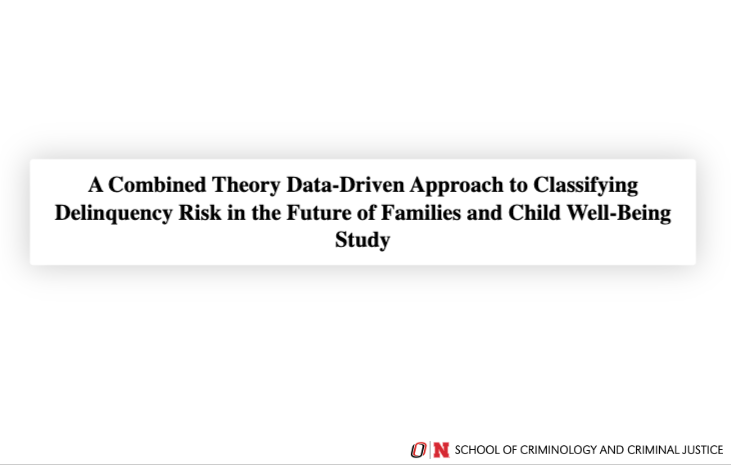
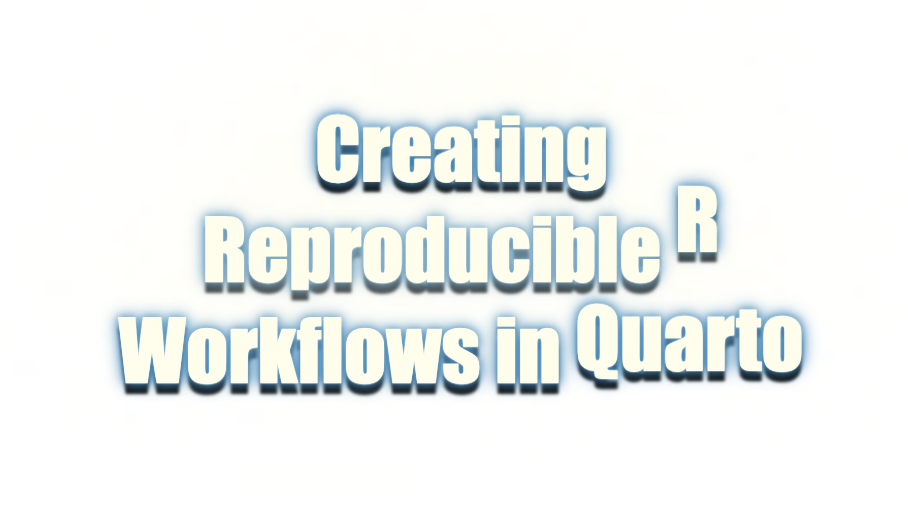

Some talks I've given. You can find slides, references, and supplemental materials—including practice exercises and workshop content—at the corresponding GitHub repositories.  Feel free to reach out with any questions.

### A Combined Theory Data-Driven Approach to Classifying Delinquency Risk in the Future of Families and Child Well-Being Study

  

ASC 2024 Meeting in San Francisco

Session: Advancing Methodological Approaches to Biopsychosocial Research

GitHub: https://github.com/nvietto/talk-ASC24

### Creating Reproducible R Workflows in Quarto

  

Guest Lecture in Advanced Statistics UNO 

Talk/workshop on making reproducible workflows in Quarto

GitHub: https://github.com/nvietto/talk-quarto

