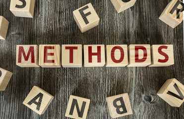

This page provides teaching materials for the courses I've developed and taught. Below, you'll find links to slides, assignments, and additional resources. Feel free to use and share them.

### Research Methods 

  

This is an undergraduate criminology and criminal justice research methods course. The course material was adapted from [CRCJ 2510 Research Methods course](https://jnix.netlify.app/courses/crcj2510/). 

GitHub: https://github.com/nvietto/Teaching/tree/main/CRCJ-2510

### Applied Statistics

  

This is an undergraduate criminology and criminal justice applied statistics course.

GitHub: https://github.com/nvietto/Teaching/tree/main/CRCJ-3000

