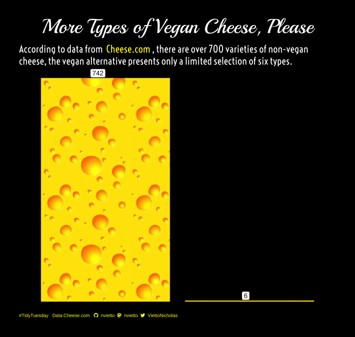

TidyTuesday is a weekly social data challenge in R, where participants use a new data set each week to create a data visualization and share their work on social media with #TidyTuesday. For more information on how to participate head [here](https://github.com/rfordatascience/tidytuesday).

 

  

 

  

  

  

  

  

  

