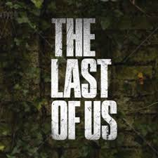
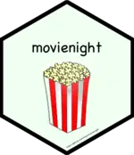

These are some fun packages I've created for R users. 

### nopunintended

  

nopunintended is a package designed to take your mind off coding with puns from ['No Pun Intended: Volume Too'](https://thelastofus.fandom.com/wiki/No_Pun_Intended:_Volume_Too) in the show/video game ['The Last of Us'](https://www.hbo.com/the-last-of-us). Check it out [here](https://github.com/nvietto/nopunintended).

### movienight

  

movienight is a package that recommend a film within RStudio. Check it out [here](https://github.com/nvietto/movienight).

