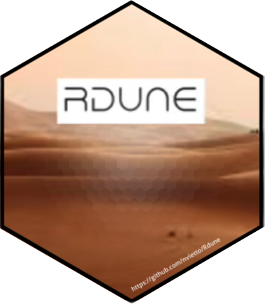

These are some fun packages I've created for R users.

### [Rdune](https://github.com/nvietto/Rdune)

  

The {Rdune} package offers a unique collection of color palettes inspired by "Dune," designed for use in data visualizations and graphics with ggplot2.

### [nopunintended](https://github.com/nvietto/nopunintended)

  

nopunintended is a package designed to take your mind off coding with puns from ['No Pun Intended: Volume Too'](https://thelastofus.fandom.com/wiki/No_Pun_Intended:_Volume_Too) in the show/video game ['The Last of Us'](https://www.hbo.com/the-last-of-us). 

GitHub: https://github.com/nvietto/nopunintended

### [movienight](https://github.com/nvietto/movienight)

  

movienight is a package that recommends a film within RStudio.

GitHub: https://github.com/nvietto/movienight

