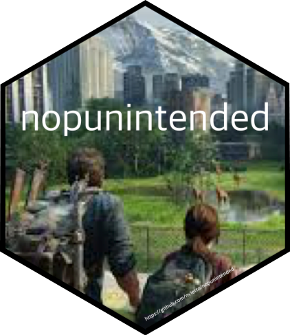

### [samplezoo](https://nvietto.github.io/samplezoo/)

  

The {samplezoo} package simplifies the generation of samples from various probability distributions, enabling users to quickly create datasets for demonstrations, troubleshooting, or teaching. By prioritizing simplicity and speed over the customization of sample parameters, {samplezoo} is ideal for beginners or anyone looking to save time when working with data.

CRAN: https://CRAN.R-project.org/package=samplezoo

GitHub: https://nvietto.github.io/samplezoo/

### [Rdune](https://nvietto.github.io/Rdune/)

  

The {Rdune} package offers a collection of color palettes inspired by 'Dune', designed for use in data visualizations and graphics with {ggplot2}. The structure of the code and creative inspiration were drawn from the[{PrettyCols}](https://github.com/nrennie/PrettyCols), [{wesanderson}](https://github.com/karthik/wesanderson), [{MetBrewer}](https://github.com/BlakeRMills/MetBrewer), [{PNWColors}](https://github.com/jakelawlor/PNWColors) packages.

CRAN:  https://CRAN.R-project.org/package=Rdune 

GitHub: https://nvietto.github.io/Rdune/

### [nopunintended](https://github.com/nvietto/nopunintended)

  

{nopunintended} is a package designed to take your mind off coding with puns from ['No Pun Intended: Volume Too'](https://thelastofus.fandom.com/wiki/No_Pun_Intended:_Volume_Too) in the show/video game ['The Last of Us'](https://www.hbo.com/the-last-of-us). 

GitHub: https://github.com/nvietto/nopunintended

### [movienight](https://github.com/nvietto/movienight)

  

{movienight} is a package that recommends a film.

GitHub: https://github.com/nvietto/movienight

